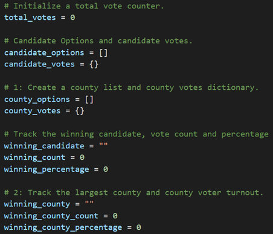
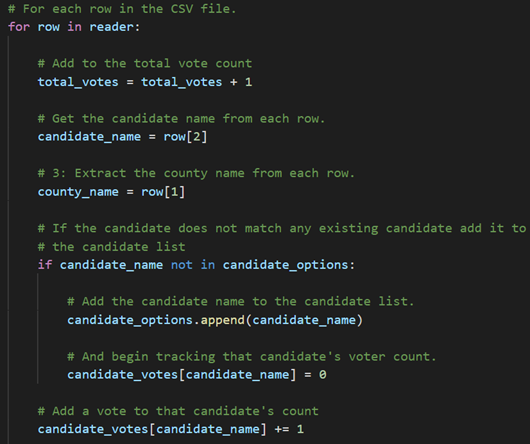

# Election_Analysis

## Project Overview
The Election Analysis was requested by a Colorado Board of Elections employee to audit the tabulated election results for the U.S. Congressional precinct in Colorado.

The following tasks completed:

1. Calculate the total number of votes cast.
2. Get a complete list of candidates who received votes.
3. Calculate the total number of votes each candidate received.
4. Calculate the percentage of votes each candidate won.
5. Determine the winner of the election based on popular vote.
6. Calculate the voter turnout for each county.
7. Calculate the percentage of votes from each county out of the total count.
8. Determine the county with the highest turnout.

## Resources
- Data Source: election_results.csv
- Software: Python 3.7.6, Visual Studio Code 1.63.2

# Summary
The analysis of the election show that:
- There were 369,711 votes cast in the election.
- The candidates were: 
    - Charles Casper Stockham
    - Diana DeGette
    - Raymon Anthony Doane
- The candidate results were:
    - Charles Casper Stockham received 23.0% of the vote and 85,213 number of votes. 
    - Diana DeGette received 73.8% of the vote and 272,892 number of votes.
    - Raymon Anthony Doane received 3.1% of the vote and 11,606 number of votes.
- The winner of the election was:
    - Diana DeGette who received 73.8% of the vote and 272,892 number of votes.
- The voter turnout for each county was:
    - Jefferson: 10.5% (38,855)
    - Denver: 82.8% (306,055)
    - Arapahoe: 6.7% (24,801)
- The county with the highest turnout was:
    - Denver with 306,055 voters, which was 82.8% of the total number of voters.

## Challenge Overview
The election audit was conducted using basic Python code to read and analyze a CSV file containing the election data. A description and snapshots of the code used to calculate the requested items are shown below.

### Variables
Variables were initialized and empty lists and dictionaries were created to hold the data.

### for loops
A for loop was written to extract the candiate names and to track each candidate's vote counts. The for loop also extracted county names and votes from each county.

A for loop was written to retreive total vote counts and percentages for each candidate and to determine the winning candidate.

A for loop was written to determine the winning county and to get its vote count.

## Challenge Summary
The script used for the election data from the U.S. Congressional precinct in Colorado can be replicated, with minor modificiations, to provide an efficient method of analayzing similar data from any election.

### Example 1

### Example 2
